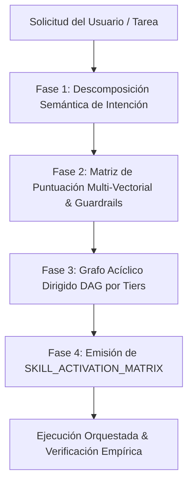

# Meta-Skill: Identify (Skill Router, Orchestrator & Dependency Resolver)

`identify` es la meta-habilidad central de enrutamiento, análisis de intención, orquestación y resolución de dependencias entre habilidades (*skills*). Su objetivo es garantizar que ante cualquier requerimiento del usuario, el agente active de forma metódica, lógica y jerárquica las habilidades exactas necesarias, respetando los *guardrails* innegociables de calidad, seguridad y arquitectura.

---

## 1. Arquitectura y Principios de Enrutamiento

1. **Intención sobre Sintaxis**: Descompone no solo lo que el usuario pide explícitamente, sino las implicaciones arquitectónicas y los efectos secundarios implícitos de la tarea.
2. **Jerarquía y Autoridad**: Las habilidades del *Workspace/Proyecto* tienen máxima prioridad y sobreescriben a las habilidades globales o genéricas.
3. **Pipeline Topológico por Tiers**: Ninguna tarea de implementación puede ejecutarse sin haber satisfecho primero los *Guardrails de Seguridad* (Tier 1) y la *Planificación Arquitectónica* (Tier 2).
4. **Cero Redundancia (KISS & YAGNI)**: Selecciona únicamente el conjunto mínimo necesario de habilidades que resuelven el problema con la máxima excelencia y rigor técnico.

---

## 2. Catálogo Maestro de Habilidades Mapeadas

### 2.1 Workspace & Project Skills (Máxima Prioridad)
| Skill | Dominio / Propósito | Activación Clave |
| :--- | :--- | :--- |
| `anti-hallucination-strict-error-handling` | **Guardrail Universal**: Cero alucinaciones, prohibición de `@ts-ignore`, no `try/catch` vacíos, verificación empírica estricta (`tsc`, tests). | **Obligatorio** en cualquier tarea que cree/modifique código, diagnostique bugs o ejecute comandos. |
| `taste-skill` | **UI/UX High-Aesthetic**: Metodología GPT-Taste, bloque obligatorio `design_plan`, matemática de layout, tipografía, paletas HSL, anti-clichés. | Interfaces web, landing pages, secciones Hero, rediseños visuales. |
| `ui-component-builder` | **Componentes UI Premium**: Catálogo Magic UI, Radix, Shadcn UI, Tailwind, Framer Motion, Cobe 3D. | Creación o mejora de componentes interactivos y visuales. |
| `supabase` | **Integración Supabase**: Cliente SDK, Auth, Storage, Edge Functions, RPC, Realtime, configuración de entorno. | Operaciones con backend Supabase, autenticación, storage. |
| `supabase-postgres-best-practices` | **Base de Datos & SQL**: Esquema Postgres, migraciones versionadas, RLS policies, índices, rendimiento, patrón Headless CMS (`JSONB`). | Modificación de esquema, consultas SQL, políticas RLS, migraciones. |

---

### 2.2 Global Agent & AI Architecture Skills
| Skill | Dominio / Propósito | Activación Clave |
| :--- | :--- | :--- |
| `agent-memory-systems` | Arquitectura de memoria de agentes (corto/largo plazo, vector stores, retención contextual). | Diseño de agentes con persistencia contextual y memoria a largo plazo. |
| `agent-memory-mcp` | Sistema híbrido de memoria persistente basado en MCP (decisiones, patrones, arquitectura). | Integración de memoria persistente entre sesiones. |
| `ai-agent-development` | Flujo de desarrollo de agentes autónomos, multi-agentes con LangGraph, CrewAI o arquitecturas custom. | Creación de agentes autónomos, pipelines de agentes cooperativos. |
| `ai-agents-architect` | Diseño y arquitectura experta de agentes de IA, uso de tools, estrategias de planning y orquestación. | Arquitectura de alto nivel de sistemas basados en LLM y agentes. |
| `ai-engineer` | Aplicaciones LLM en producción, pipelines RAG avanzados, búsqueda vectorial y multimodalidad. | Implementación de RAG, embeddings, orquestación de modelos LLM. |
| `ai-product` | Patrones de integración de LLMs en productos comerciales, optimización de prompts y confiabilidad. | Funcionalidades de IA en productos SaaS y aplicaciones web. |
| `ai-analyzer` | Análisis multimodal de patrones, predicciones y reportes inteligentes de datos. | Módulos de análisis inteligente y generación de reportes IA. |
| `ai-wrapper-product` | Creación de micro-SaaS y wrappers enfocados en valor real sobre APIs de IA. | Desarrollo de productos específicos impulsados por modelos de IA. |
| `agent-orchestration-multi-agent-optimize` | Optimización y distribución de carga en sistemas multi-agente. | Perfilado, reducción de latencia y costos en flujos multi-agente. |
| `agent-orchestration-improve-agent` | Iteración sistemática y mejora de prompts/comportamiento de agentes. | Refactorización y tuning de agentes existentes. |
| `agent-tool-builder` | Diseño y creación de herramientas robustas (tools) para agentes. | Creación de interfaces de herramientas para LLMs. |
| `agent-evaluation` | Benchmarks, testing conductual y monitoreo de confiabilidad de agentes. | Validación y evaluación sistemática de agentes. |
| `agents-md` | Mantenimiento y síntesis de documentación concisa y de alta señal para agentes (`AGENTS.md`). | Creación o actualización de normas de gobernanza de agentes. |

---

### 2.3 Frontend, UI/UX, 3D & Mobile Skills
| Skill | Dominio / Propósito | Activación Clave |
| :--- | :--- | :--- |
| `3d-web-experience` | Experiencias 3D interactivas: Three.js, React Three Fiber, Spline, WebGL, shaders. | Canvas 3D inmersivos, configuradores de producto, visualizaciones espaciales. |
| `antigravity-design-expert` | UI/UX espacial, interfaces weightless, glassmorphism avanzado con GSAP y 3D CSS. | Micro-interacciones complejas, animaciones cinemáticas web. |
| `android-cli` | Herramientas de terminal Android, gestión de emuladores, SDKs y proyectos móviles. | Desarrollo y compilación de aplicaciones Android. |
| `android_ui_verification` | Pruebas UI end-to-end automatizadas en emulador Android mediante ADB. | Validación visual y funcional en entorno móvil Android. |

---

### 2.4 JavaScript, TypeScript & Testing Skills
| Skill | Dominio / Propósito | Activación Clave |
| :--- | :--- | :--- |
| `javascript-pro` | Patrones avanzados de ECMAScript moderno (ES6+), async/await, APIs de Node.js y compatibilidad. | Lógica de negocio en JS/TS, optimización de runtime. |
| `javascript-typescript-typescript-scaffold` | Estructuras de proyectos TypeScript robustas, tooling moderno (Vite, pnpm/npm). | Configuración inicial, scaffolding de módulos y tipado estricto. |
| `javascript-testing-patterns` | Estrategias de testing con Vitest, Jest, React Testing Library, mocks y TDD. | Creación de tests unitarios, de integración y end-to-end. |

---

### 2.5 Framework Antigravity, Workflow & Productividad
| Skill | Dominio / Propósito | Activación Clave |
| :--- | :--- | :--- |
| `antigravity-guide` | Manual exhaustivo del ecosistema Antigravity (IDE, CLI, slash commands, keybindings). | Consultas sobre el funcionamiento y capacidades de Antigravity. |
| `agy-customizations` | Sistema de personalización de Antigravity (skills, rules, MCP servers, hooks, sidecars). | Creación y configuración de nuevas habilidades y extensiones. |
| `antigravity-workflows` | Orquestación guiada de workflows para MVPs SaaS, auditorías de seguridad y QA en navegador. | Flujos completos de ciclo de vida de desarrollo. |
| `app-builder` | Orquestador de creación de aplicaciones completas full-stack desde lenguaje natural. | Inicialización de proyectos completos desde cero. |
| `ticktick` | Automatización y sincronización de tareas con TickTick. | Comandos `/ticktick` o gestión de tareas personales del usuario. |

---

### 2.6 Plugins Científicos, Genómicos & Bases de Datos Especializadas
| Categoría | Skills Incluidas | Propósito Principal |
| :--- | :--- | :--- |
| **Búsqueda Bibliográfica** | `literature-search-arxiv`, `literature-search-biorxiv`, `literature-search-europepmc`, `literature-search-openalex`, `pubmed-database` | Búsqueda y extracción de papers, preprints y literatura médica/científica. |
| **Genómica & Variantes** | `alphagenome-single-variant-analysis`, `dbsnp-database`, `clinvar-database`, `gnomad-database`, `ensembl-database`, `ucsc-conservation-and-tfbs` | Análisis de variantes genéticas, frecuencias alélicas, patogenicidad y conservación. |
| **Proteínas & Estructura 3D** | `alphafold-database-fetch-and-analyze`, `foldseek-structural-search`, `pdb-database`, `pymol`, `protein-sequence-msa`, `protein-sequence-similarity-search`, `uniprot-database`, `interpro-database`, `human-protein-atlas-database` | Modelado 3D, búsqueda estructural, alineamiento de secuencias y expresión proteica. |
| **Química & Farmacología** | `pubchem-database`, `chembl-database`, `openfda-database`, `opentargets-database`, `clinical-trials-database` | Moléculas bioactivas, dianas terapéuticas, ensayos clínicos y farmacovigilancia. |
| **Regulación & Ontologías** | `jaspar-database`, `unibind-database`, `encode-ccres-database`, `quickgo-database`, `embl-ebi-ols`, `reactome-database`, `string-database`, `gtex-database` | Factores de transcripción, vías biológicas, interacción proteína-proteína y ontologías. |
| **Humanidades Digitales** | `predictingthepast` | Restauración, datación y contextualización de textos antiguos (latín/griego). |
| **Infraestructura & Utils** | `credentials`, `uv`, `workflow-skill-creator` | Gestión segura de claves API, entorno Python ultrarrápido y creación de skills. |

---

## 3. Algoritmo de Enrutamiento y Orquestación en 4 Fases

El enrutador ejecuta obligatoriamente este pipeline lógico secuencial:



---

### Fase 1: Descomposición Semántica de Intención

1. **Clasificación de Dominio Primario y Secundario**:
   - `UI_UX`: Diseño visual, layout, estilos CSS, animaciones, componentes.
   - `BACKEND_DATABASE`: Supabase, Postgres, SQL, esquemas, APIs, RPC, RLS.
   - `AI_ORCHESTRATION`: Agentes, RAG, prompts, flujos LLM, memoria vectorial.
   - `FULLSTACK_APP`: Combinación integrada de frontend + backend.
   - `BIO_SCIENCE`: Consultas genómicas, proteómicas, químicas o bibliografía médica.
   - `MAINTENANCE_TESTING`: Refactor, fixes de compilación, testing, documentación.

2. **Extracción de Requisitos Explícitos e Implícitos**:
   - *Explícitos*: Nombres de componentes, librerías mencionadas, acciones directas solicitadas.
   - *Implícitos*:
     - Si se modifica UI $\rightarrow$ Requiere planificación visual (`taste-skill`) y accesibilidad/animación (`ui-component-builder`).
     - Si se modifica base de datos $\rightarrow$ Requiere validación de esquema, migraciones versionadas y RLS (`supabase-postgres-best-practices`).
     - Si se añaden campos dinámicos $\rightarrow$ Patrón `JSONB` obligatorio (evitar `ALTER TABLE` arbitrario).
     - Si se escribe/corrige código $\rightarrow$ Guardrail `anti-hallucination-strict-error-handling` obligatorio.

3. **Vector de Riesgo y Complejidad**:
   - Nivel de riesgo: `BAJO` (estilos cosméticos), `MEDIO` (componente interactivo), `ALTO` (migración de BD, autenticación, borrado de datos).

---

### Fase 2: Matriz de Puntuación Multi-Vectorial y Resolución de Conflictos

Para cada skill candidata $S$, se calcula su Puntuación de Activación ($P_S$):

$$P_S = (W_{\text{relevancia}} \times S_{\text{semántica}}) + (W_{\text{autoridad}} \times S_{\text{workspace}}) + S_{\text{guardrail}}$$

- **Regla de Guardrail**: $S_{\text{guardrail}} = \infty$ si la tarea involucra código o diagnóstico (`anti-hallucination-strict-error-handling`).
- **Regla de Co-Ocurrencia**:
  - `UI_UX` $\implies$ Activar en conjunto (`taste-skill` + `ui-component-builder`).
  - `DATABASE` $\implies$ Activar en conjunto (`supabase` + `supabase-postgres-best-practices`).
- **Resolución de Conflictos**: Si compiten una skill general (`javascript-pro`) y una específica de workspace (`supabase-postgres-best-practices`), la de workspace toma precedencia.

---

### Fase 3: Grafo de Dependencias (DAG) y Pipeline Secuencial por Tiers

Las habilidades seleccionadas deben ejecutarse estrictamente ordenadas en 4 Tiers:

```mermaid
graph LR
    subgraph Tier 1: Guardrails Innegociables
        T1[anti-hallucination-strict-error-handling<br/>credentials / agents-md]
    end
    subgraph Tier 2: Planificación & Memoria
        T2[taste-skill (design_plan)<br/>supabase-postgres-best-practices (Esquema/RLS)<br/>agent-memory-systems]
    end
    subgraph Tier 3: Implementación & Core
        T3[ui-component-builder<br/>supabase SDK<br/>3d-web-experience<br/>javascript-pro]
    end
    subgraph Tier 4: Verificación & Calidad
        T4[javascript-testing-patterns<br/>tsc --noEmit / build / tests<br/>pmb-ai session brief]
    end

    T1 --> T2 --> T3 --> T4
```

1. **Tier 1 — Guardrails & Baseline Protocol**:
   - Establece la política de cero alucinaciones, no silenciar errores y manejo estricto de excepciones.
2. **Tier 2 — Discovery, Memory & Architecture Planning**:
   - Generación de `design_plan` visual, análisis de esquema de base de datos o recuperación de memoria contextual.
3. **Tier 3 — Core Implementation & Domain Execution**:
   - Construcción de componentes, escritura de consultas SQL/RLS, integración de modelos o 3D.
4. **Tier 4 — Verification, Quality Assurance & Session Persistence**:
   - Verificación de tipos (`tsc --noEmit`), tests automatizados, registro de hechos aprendidos.

---

### Fase 4: Formato de Salida Estructurado (`[SKILL_ACTIVATION_MATRIX]`)

Cuando el agente aplique este meta-proceso, formalizará interna o explícitamente la siguiente matriz:

```markdown
### 🧭 [SKILL_ACTIVATION_MATRIX]

- **Intención Detectada**: [Resumen conciso del objetivo]
- **Dominio(s)**: [UI_UX | BACKEND_DATABASE | AI_ORCHESTRATION | FULLSTACK_APP | etc.]
- **Vector de Riesgo**: [BAJO | MEDIO | ALTO]

#### Pipeline de Ejecución por Tiers:
1. **Tier 1 (Guardrails)**: `anti-hallucination-strict-error-handling`
2. **Tier 2 (Planificación)**: `taste-skill` (requiere bloque `design_plan`) / `supabase-postgres-best-practices`
3. **Tier 3 (Implementación)**: `ui-component-builder` / `supabase` / `javascript-pro`
4. **Tier 4 (Verificación)**: `npx tsc --noEmit` / `javascript-testing-patterns`

- **Habilidades Excluidas / Podadas**: [Lista de skills descartadas y motivo]
- **Criterio de Éxito**: [Comando o test verificable que demostrará el éxito empírico]
```

---

## 4. Reglas de Activación Automática y Guardrails Innegociables

1. **Guardrail Universal de Código**:
   - Toda tarea que cree, modifique o depure código **DEBE** activar `anti-hallucination-strict-error-handling`. Queda prohibido el uso de `// @ts-ignore`, `any`, o `catch` silenciosos.
2. **Dupla Obligatoria de Frontend (UI/UX)**:
   - Toda creación o modificación de vistas, páginas o componentes requiere invocar `taste-skill` (con emisión de `design_plan`) y `ui-component-builder`.
3. **Dupla Obligatoria de Base de Datos**:
   - Toda interacción con datos persistentes de Supabase/Postgres requiere `supabase` y `supabase-postgres-best-practices`.
   - Si se solicitan campos o columnas dinámicas administrables, **siempre** usar el patrón `JSONB` (`custom_fields`), **nunca** DDL/`ALTER TABLE` en tiempo de ejecución.
4. **Verificación Previa a la Confirmación**:
   - Ninguna tarea se considera completa sin ejecutar la herramienta de verificación real (`npx tsc --noEmit`, build de Vite o suite de tests).

---

## 5. Ejemplos de Enrutamiento Práctico

### Caso A: "Quiero diseñar una nueva sección Hero con testimonios y animaciones suaves"
- **Descomposición**: Dominio `UI_UX`, riesgo `MEDIO`.
- **Skills Activadas**:
  - Tier 1: `anti-hallucination-strict-error-handling`
  - Tier 2: `taste-skill` (redactar bloque `design_plan` con paleta HSL, tipografía y layout matemático)
  - Tier 3: `ui-component-builder` (Magic UI, Framer Motion, Radix)
  - Tier 4: Verificación de responsive, contraste WCAG AA y compilación TypeScript.

---

### Caso B: "Crea una tabla en Supabase para gestionar peticiones de oración con campos personalizables"
- **Descomposición**: Dominio `BACKEND_DATABASE`, riesgo `ALTO`.
- **Skills Activadas**:
  - Tier 1: `anti-hallucination-strict-error-handling`
  - Tier 2: `supabase-postgres-best-practices` (diseño de esquema con columna `JSONB custom_fields`, políticas RLS estrictas)
  - Tier 3: `supabase` (migración versionada SQL, integración con el cliente Supabase)
  - Tier 4: Verificación de compilación de tipos (`tsc`) y validación de políticas RLS.

---

### Caso C: "Investiga mutaciones genéticas asociadas al gen BRCA1 y sus estructuras 3D reportadas"
- **Descomposición**: Dominio `BIO_SCIENCE`, riesgo `BAJO`.
- **Skills Activadas**:
  - Tier 1: `credentials` (verificar acceso a APIs científicas)
  - Tier 2: `pubmed-database` & `clinvar-database` (búsqueda de literatura y patogenicidad de variantes)
  - Tier 3: `alphafold-database-fetch-and-analyze` & `pdb-database` & `pymol` (estructuras 3D y visualización)
  - Tier 4: Síntesis estructurada y citas exactas de literatura.

---

## 6. Checklist de Autoevaluación del Router (`identify`)

Antes de iniciar la ejecución de cualquier tarea, responde:
- [ ] ¿He identificado los dominios explícitos e implícitos de la solicitud?
- [ ] ¿Está incluido `anti-hallucination-strict-error-handling` si se tocará código?
- [ ] ¿Se respetan las dependencias en orden jerárquico (Tier 1 $\rightarrow$ Tier 2 $\rightarrow$ Tier 3 $\rightarrow$ Tier 4)?
- [ ] ¿He descartado librerías o skills redundantes para mantener la solución limpia (KISS/YAGNI)?
- [ ] ¿Está definido el mecanismo de verificación empírica antes de dar la tarea por finalizada?
