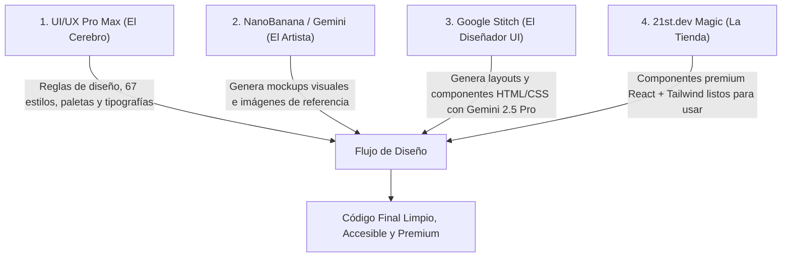

# 🛠️ Toolkit de Diseño Web y Herramientas de IA de Próxima Generación

Este documento documenta las herramientas, servidores MCP, plugins, librerías 3D y flujos de trabajo para diseñar y construir interfaces web de vanguardia en el proyecto **Iglesia Jerusalén**.

---

## 1. El Ecosistema "Diseñador Web Definitivo"

La combinación de 4 herramientas especializadas transforma la generación de interfaces en un flujo profesional:



### A. UI/UX Pro Max GO (El Cerebro de Diseño)
- **Propósito**: Proporciona a la IA conocimiento estructurado de 67 estilos visuales (Glassmorphism, Minimalismo, Neomorfismo sutil, etc.), 161 paletas cromáticas por industria, 57 combinaciones de Google Fonts y 99 reglas de UX.
- **Instalación y Configuración**:
  ```bash
  npm install -g uipro-cli
  uipro init --ai claude
  ```

### B. NanoBanana MCP (El Artista - Generación de Mockups con Gemini)
- **Propósito**: Genera mockups y referencias visuales usando los modelos multimodales Gemini de Google antes de escribir código.
- **Configuración (`.mcp.json`)**:
  ```json
  {
    "mcpServers": {
      "nanobanana": {
        "command": "uvx",
        "args": ["nanobanana-mcp-server@latest"],
        "env": {
          "GEMINI_API_KEY": "TU_GEMINI_API_KEY"
        }
      }
    }
  }
  ```

### C. Google Stitch MCP (El Diseñador UI con Gemini 2.5 Pro)
- **Propósito**: Diseña pantallas y componentes con HTML y CSS responsive basados en la API de Stitch de Google.
- **Configuración rápida**:
  ```bash
  npx @_davideast/stitch-mcp init
  ```
- **Configuración manual (`.mcp.json`)**:
  ```json
  {
    "mcpServers": {
      "stitch": {
        "command": "npx",
        "args": ["-y", "stitch-mcp"],
        "env": {
          "GOOGLE_CLOUD_PROJECT": "TU_PROJECT_ID"
        }
      }
    }
  }
  ```

### D. 21st.dev Magic (La Tienda de Componentes Premium)
- **Propósito**: Acceso a miles de componentes premium de React + Tailwind CSS (Hero sections, bento grids, pricing tables, navegaciones).
- **Instalación**:
  ```bash
  npx @21st-dev/cli@latest install claude --api-key TU_21ST_API_KEY
  ```

---

## 2. Metodología GPT-Taste (`taste-skill`)

Basada en el repositorio [Leonxlnx/taste-skill](https://github.com/Leonxlnx/taste-skill).

### Reglas Clave:
1. **Bloque `design_plan` previo al código**: Define matemática del ancho del hero, jerarquía tipográfica, contrastes y paradigmas de animación.
2. **Layout Math**: Diseñar con proporciones deliberadas (`max-w-7xl`, `grid-cols-[1fr_1fr]`, `gap-12`) y nunca usar clamps fijos que provoquen colisión de texto.
3. **Control de Densidad y Cero Clichés**:
   - Prohibido el *Card-Ception* (tarjetas dentro de tarjetas dentro de marcos rotados).
   - Prohibidos los degradados en texto de palabras clave a menos que aporten valor editorial sobrio.
   - Micro-animaciones fluidas con soporte para `prefers-reduced-motion`.

---

## 3. Experiencias 3D y WebGL

### A. Meshy AI ([meshy.ai/es/integrations](https://www.meshy.ai/es/integrations))
- Generación de modelos 3D con IA (Text-to-3D, Image-to-3D).
- Exportación directa a formatos estándar (`.glb`, `.gltf`, `.fbx`, `.obj`) listos para Three.js y React Three Fiber.

### B. Open Design WebGL 3D Object ([open-design.ai/es/plugins/webgl-3d-object/](https://open-design.ai/es/plugins/webgl-3d-object/))
- Componentes WebGL interactivos embebidos para landings y héroes:
  - Globos interactivos (Cobe 3D / Three.js).
  - Objetos 3D espaciales con shaders e iluminación reactiva al cursor.
  - Efectos de partículas atmosféricas y distorsión de cristal.

---

## 4. Memoria y Scraping Avanzado (Servidores MCP Adicionales)

### A. Bright Data MCP Server ([github.com/luminati-io/brightdata-mcp](https://github.com/luminati-io/brightdata-mcp))
- **Uso**: Extracción de datos y benchmarking visual web sin bloqueos ni CAPTCHAs (más de 30 herramientas de scraping optimizadas).
- **Configuración**:
  ```bash
  git clone https://github.com/luminati-io/brightdata-mcp
  cd brightdata-mcp
  npm install
  npm start
  ```

### B. Graphiti MCP Server ([rawr-mcp-graphiti](https://github.com/getzep/graphiti))
- **Uso**: Memoria semántica y grafo de conocimiento a largo plazo persistido en **Neo4j** para rastrear relaciones, decisiones arquitectónicas e historial entre sesiones.
- **Configuración**:
  ```bash
  pipx install 'rawr-mcp-graphiti[cli]'
  cd my-cool-project
  graphiti compose
  graphiti up -d
  graphiti init team-tracker
  ```

---

## 5. Aplicación en el Proyecto Iglesia Jerusalén

En este proyecto, combinamos:
- **Tokens de Color Institucionales**: Azul Primario `#1E3A8A` y Dorado Oficial `#C79D3F` (`--color-church-gold`).
- **Tipografías**: Playfair Display (Serif para títulos) e Inter (Sans-serif para lectura).
- **Librería de Componentes**: Magic UI, Framer Motion y Tailwind CSS v4.
- **Metodología Taste-Skill**: Toda nueva pantalla sigue el bloque `design_plan` y valida accesibilidad WCAG AA antes de finalizar.
