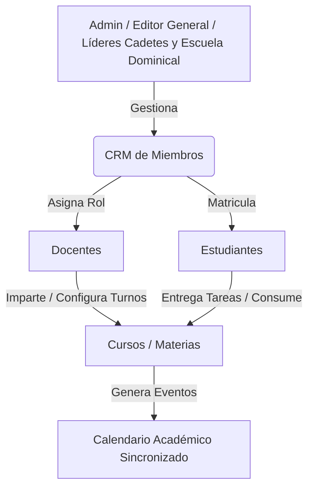

# Plan Maestro Universitario - Ecosistema LMS (Estilo UNEMI / Moodle)

Este documento representa la **Hoja de Ruta Permanente (Plan Maestro)** para la transformación del Aula Virtual de la Iglesia Jerusalén en una plataforma universitaria de educación de grado superior, modelada a partir de los mejores estándares de diseño y arquitectura de plataformas como Moodle y el entorno virtual de la Universidad UNEMI.

---

## 1. Visión y Filosofía de Diseño
El objetivo es ofrecer una experiencia educativa verdaderamente profesional, estructurada y visualmente impactante (Glassmorphism, gradientes HSL curated, micro-animaciones GSAP/Framer Motion), conectada nativamente con la base de datos de miembros (CRM) y con un control de acceso (RBAC) robusto y granular.

---

## 2. Análisis Paso a Paso de Capturas de Referencia (UNEMI)

### Captura 1: Estructura de Curso por Unidades y Semanas
- **Hero Banner Modular:** Encabezado con imagen de fondo, código del curso (ej. `[011-EA-001] - C1 - MULTIMEDIA`), barra de progreso global (ej. 78%) y botón de acción rápida *"Continuar"*.
- **Navegación por Pestañas:** Organización horizontal limpia por pestañas: *General*, *Unidad 1*, *Unidad 2*, *Unidad 3*, *Unidad 4*, permitiendo al estudiante focalizarse en el periodo actual sin sobrecarga visual.
- **Acceso Sincrónico y Contacto:** Bloques plegables para enlaces de videollamada (Google Meet / Zoom) y horarios detallados por turnos (ej. *Turno 9 [14:00 PM a 14:59 PM] | Martes*).

### Captura 2: Categorización del Aprendizaje (Dashboard de Curso)
- **Pestañas Superiores de Sección:** *Curso*, *Participantes*, *Calificaciones*, *Competencias*.
- **Tarjetas de Actividades / Metodología:** Visualización en cuadrícula (Grid) que agrupa los recursos y evaluaciones en categorías pedagógicas claras:
  1. Clases virtuales / Clases de refuerzo
  2. Actividades autónomas
  3. Actividades en contacto con el docente
  4. Foros de debate
  5. Compendios / Dossiers / Guías del estudiante
  6. Presentaciones / Videos Magistrales
  7. Material complementario / Prácticas experimentales / Simulaciones / Exámenes
- *Interactividad:* Barras de progreso individuales por tarjeta (ej. *87% complete*, *100% complete*) y botones CTA (*"empecemos"*).

### Captura 3: Gestión Masiva de Participantes
- **Tabla de Matriculados:** Listado claro con foto, nombres completos, rol (*Estudiante*, *Docente*), grupo asignado y tiempo desde el *"Último acceso al curso"*.
- **Acciones por Lote (Batch Actions):** Checkboxes de selección múltiple con menú de acciones masivas (*"Con los usuarios seleccionados... Elegir: Enviar mensaje, Matricular, Desmatricular"*).

### Captura 4: Gradebook Universitario (Libro de Calificaciones)
- **Desglose Estructurado (Rúbrica Universitaria):** Clasificación por notas parciales y experimentales:
  - **N1, N2, EXP1** (Primer ciclo / parcial)
  - **N3, N4, EXP2** (Segundo ciclo / parcial)
  - **EXT** (Examen Extraordinario / Recuperación) y **RE** (Resumen/Evaluación final).
- **Cálculo Automático:** Sumatoria y ponderación en tiempo real (*Total del curso: 45,20*).
- **Retroalimentación Cualitativa (Feedback):** Columna dedicada donde el docente deja comentarios personalizados sobre el desempeño (*"¡Buen trabajo! Se nota el esfuerzo realizado..."*).

### Captura 5: Calendario Académico Integral Sincronizado
- **Vistas Múltiples:** Mes completo, Semana, Día y Agenda personalizada.
- **Código de Colores (Pills):** Identificación visual instantánea para tipos de eventos (Examen = Rojo/Ámbar, Tarea = Azul/Violeta, Clase Sincrónica = Verde, Evento General = Dorado).
- **Sincronización Total:** Alimenta eventos dinámicamente desde las fechas de apertura y cierre (deadlines) de todas las materias del usuario.

### Captura 6: Tareas y Entregas con Drag & Drop
- **Detalle de Asignación:** Fechas de *Apertura* y *Cierre* claramente marcadas, estado del envío (*Por hacer*, *Enviado para calificar*, *Calificado*).
- **Zona de Carga de Archivos (Upload Vault):** Cuadro de arrastrar y soltar (Drag & Drop) con validación de tipos (`.pdf`, `.docx`, `.xlsx`, `.pptx`) y límites de tamaño (ej. 10 MB, máx 20 archivos), conectado al almacenamiento privado y seguro del backend (`media_vault`).

---

## 3. Arquitectura RBAC y CRM Académico

### Reglas de Control de Acceso (RBAC)
1. **Administradores Académicos (`admin`, `editor`, líderes de `cadetes` / `escuela_dominical`):**
   - Tienen permiso total para explorar la tabla de miembros (CRM).
   - Pueden nombrar o destituir **Docentes** y asignarles su carga horaria (cuántas clases o turnos imparten, en qué cursos o programas).
   - Pueden gestionar matrículas de estudiantes de forma individual o masiva.
2. **Docentes (`teacher`, `head_teacher`):**
   - Acceden a sus cursos asignados, configuran enlaces de videollamada, revisan y califican tareas (Gradebook) y gestionan eventos de su materia en el calendario.
3. **Estudiantes (`student`):**
   - Acceden únicamente a sus cursos matriculados, envían tareas por Drag & Drop y visualizan su calendario y notas.

---

## 4. Hoja de Ruta de Ejecución por Fases (Roadmap)

### Fase 8: RBAC Académico, Cargas Docentes y Calendario Universitario Sincronizado *(Fase Actual)*
- Conexión CRM <-> LMS: Panel de Administración de Personal Docente y Estudiantil para Admins/Líderes.
- Configuración de carga horaria y asignación de materias por docente.
- Creación de tabla de eventos de calendario y refactorización completa del **Calendario Académico** con vistas (Mes, Semana, Día) y modal/lateral de detalle, sincronizado en vivo para profesores y alumnos.

### Fase 9: Estructura de Curso Moodle/UNEMI (Unidades y Categorías)
- Rediseño del `CourseViewer` introduciendo pestañas por Unidad/Semana y Hero modular con progreso.
- Implementación del Dashboard de Curso con tarjetas de categorías (Clases virtuales, Refuerzo, Actividades autónomas, Prácticas, Simulaciones).
- Módulo de enlaces sincrónicos (Google Meet / Zoom / Turnos).

### Fase 10: Entregas Drag & Drop (`media_vault`) y Gradebook Universitario
- Página de entrega de asignaciones con zona Drag & Drop conectada a Supabase Storage.
- Refactorización del Gradebook para soportar rúbrica universitaria (N1, N2, EXP, Total) y comentarios de retroalimentación cualitativa por alumno.

### Fase 11: Gestión Masiva de Participantes y Grupos de Estudio
- Tabla interactiva de participantes con checkboxes, filtros de grupo y acciones en lote (comunicaciones y matriculación masiva).

---
*Este documento se mantendrá como referencia arquitectónica inmutable para todas las iteraciones de desarrollo del Aula Virtual.*
