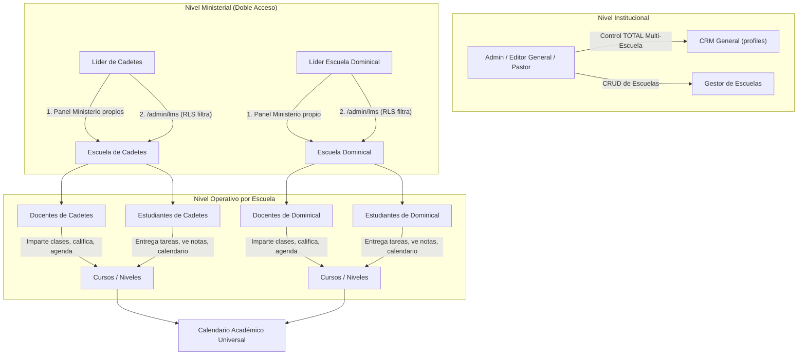
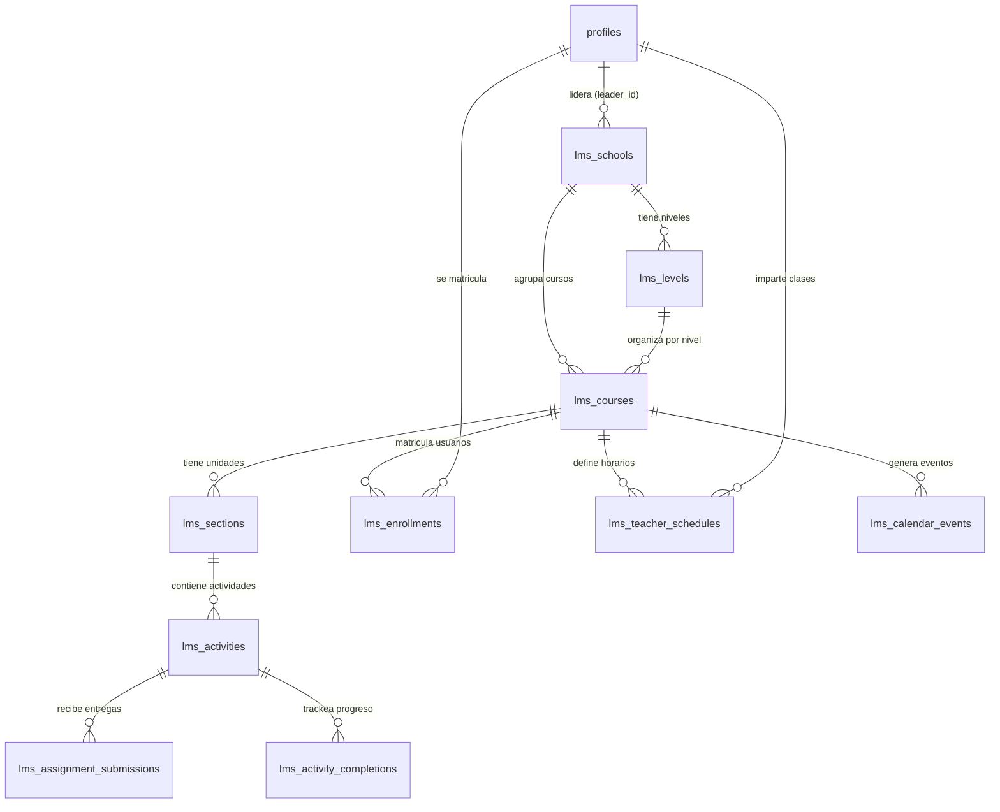

# 🏛️ Plan Maestro Universitario — Ecosistema LMS Multi-Escuela
## "El Mejor Sistema Educativo del Mundo" · Iglesia Jerusalén
### Arquitectura inspirada en UNEMI / Moodle / Canvas LMS de Grado Superior

> **Documento inmutable de referencia arquitectónica.**
> Este plan maestro NO se elimina ni se reemplaza cuando se crean planes de implementación por fase.
> Se actualiza únicamente para reflejar decisiones de diseño aprobadas por el usuario.

---

## 1. Visión y Filosofía

### 1.1 Declaración de Visión
Construir una plataforma educativa de clase mundial que permita a la Iglesia Jerusalén operar **múltiples escuelas y academias independientes** —cada una con su cuerpo docente, plan de estudios, estudiantes matriculados, niveles, calificaciones y calendario— bajo un mismo techo tecnológico, con la calidad visual y funcional de una universidad de grado superior.

### 1.2 Principios de Diseño
| Principio | Implementación |
|---|---|
| **Premium & Vivo** | Glassmorphism, gradientes HSL curados, micro-animaciones GSAP/Framer Motion, tipografía moderna (Inter/Outfit) |
| **Multi-Escuela First** | Toda entidad (curso, materia, docente, alumno, nota, evento) pertenece a una Escuela. El sistema se escala horizontalmente por escuelas |
| **RBAC Granular** | Row Level Security (RLS) en Supabase. Los líderes ven SOLO su escuela; admin/editor ven TODO |
| **CRM Nativo** | La tabla `profiles` (CRM de miembros) es la fuente única de verdad para personas. Nunca se duplican usuarios |
| **Editable en Admin** | Todo lo que el estudiante o docente ve en su vista pública/campus DEBE poder modificarse desde algún panel admin/docente/líder |
| **Offline-Ready** | PWA con Service Worker ya existente. El calendario y materiales deben funcionar con cache |

---

## 2. Ecosistema Multi-Escuela — Arquitectura Completa

### 2.1 Concepto de "Escuela"
Una **Escuela** (también llamable "Facultad" o "Academia") es la unidad organizativa máxima del sistema educativo. Funciona como un entorno independiente y autónomo dentro de la misma plataforma.

### 2.2 Escuelas Fundacionales
| # | Escuela | Público Objetivo | Niveles Típicos |
|---|---|---|---|
| 1 | **Escuela de Cadetes** | Niños, preadolescentes, líderes de cadetes | Explorador, Compañero, Guía, Conquistador, Líder |
| 2 | **Escuela Dominical** | Toda la congregación, por edades | Párvulos, Principiantes, Primarios, Intermedios, Jóvenes, Adultos |
| 3 | **Escuela de Teología y Ministerio** | Líderes, pastores en formación | Nivel Básico, Intermedio, Avanzado, Seminario |
| 4 | **[Futuras Escuelas]** | Ilimitadas, creadas dinámicamente | Escuela de Alabanza, Escuela de Misiones, Escuela de Familia, etc. |

### 2.3 Independencia Estructural por Escuela
Cada escuela opera como si fuera una universidad independiente:

```
lms_schools (Escuela)
  └── lms_levels (Niveles / Ciclos de esa escuela)
       └── lms_courses (Cursos / Materias de ese nivel)
            ├── lms_sections (Unidades / Semanas del curso)
            │    └── lms_activities (Recursos, tareas, foros, exámenes)
            ├── lms_enrollments (Estudiantes y docentes matriculados)
            ├── lms_teacher_schedules (Horarios semanales del docente)
            ├── lms_calendar_events (Exámenes, entregas, sesiones en vivo)
            └── lms_gradebook_entries (Calificaciones con rúbrica)
```

- **Catálogo y Niveles Propios:** Cada escuela define sus propios niveles (ciclos, grados, semestres) y dentro de cada nivel, sus cursos/materias.
- **Estudiantes por Escuela/Nivel:** Las matrículas son segmentadas. Un miembro del CRM puede ser **estudiante** en la Escuela de Teología y **docente** en la Escuela de Cadetes simultáneamente. Los roles son **por escuela**, no globales.
- **Carga Docente Independiente:** Cada docente tiene su propia carga horaria (turnos, días, enlaces Meet/Zoom, aulas) configurada dentro de la escuela donde imparte clases.
- **Aislamiento de Contenido:** Los materiales, anuncios, exámenes, rúbricas de calificación, foros y eventos de calendario se vinculan jerárquicamente a `Escuela → Nivel → Curso`.
- **Branding por Escuela:** Cada escuela puede tener su propia imagen de portada, descripción, color identificador y slug para URLs amigables (ej. `/escuelas/cadetes`, `/escuelas/dominical`).

### 2.4 Gestión Dinámica de Escuelas (CRUD Completo)
Los administradores y editores generales tendrán la capacidad desde `/admin/lms` de:
- **Crear** nuevas escuelas con nombre, descripción, imagen, color y líder responsable asignado.
- **Modificar** escuelas existentes (renombrar, cambiar líder, actualizar portada).
- **Eliminar** escuelas (con protección: solo si no tienen cursos activos o matrícula vigente).
- **Ordenar** la prioridad/visibilidad de las escuelas en el campus público.

---

## 3. Arquitectura RBAC, Doble Acceso y CRM Académico

### 3.1 Diagrama de Flujo de Acceso



### 3.2 Doble Acceso para Líderes de Ministerio
Para garantizar **máxima comodidad** y fluidez en la gestión, los líderes de Cadetes y Escuela Dominical disponen de un **Doble Acceso**:

#### Acceso 1: Panel Ministerial Exclusivo
- Dentro de su panel de ministerio (`/admin/ministerios/:id`), habrá una **pestaña dedicada** para gestionar su escuela académica sin salir de su entorno habitual.
- Desde aquí pueden: ver/agregar docentes, ver/agregar alumnos, gestionar horarios y ver el calendario.

#### Acceso 2: Panel General de Aula Virtual (`/admin/lms`)
- Pueden ingresar directamente al portal universitario central.
- Las **políticas RLS de Supabase** filtran automáticamente la vista:
  - El líder de Cadetes **solo ve y administra** los cursos, profesores y alumnos de la Escuela de Cadetes.
  - El líder de Escuela Dominical **solo ve y administra** su Escuela Dominical.
  - Los Admin/Editor/Pastor tienen **visibilidad global** sobre todas las Escuelas simultáneamente.

### 3.3 Reglas de Control de Acceso (RBAC) — Detalle Completo

| Rol | Gestión de Escuelas | Gestión de Docentes | Gestión de Estudiantes | Calificaciones | Calendario | Contenido Cursos |
|---|---|---|---|---|---|---|
| **Admin / Editor / Pastor** | CRUD total (crear/editar/eliminar escuelas) | Asignar/destituir en TODAS las escuelas | Matricular/desmatricular en TODAS | Ver/auditar todas | Crear eventos globales | Editar cualquier curso |
| **Líder Ministerial** | Solo ver SU escuela asignada | Asignar/destituir en SU escuela | Matricular/desmatricular en SU escuela | Ver las de SU escuela | Crear eventos de SU escuela | Editar cursos de SU escuela |
| **Docente** | No accede | No gestiona (ES gestionado) | Ve lista de SUS alumnos matriculados | Califica SUS materias (Gradebook) | Crea eventos de SUS materias | Crea/edita contenido de SUS materias |
| **Estudiante** | No accede | No accede | No gestiona (ES gestionado) | Ve SUS calificaciones (solo lectura) | Ve SU calendario personal | Consume contenido, entrega tareas |

### 3.4 Principio Fundamental: "Vista Pública ↔ Admin Editable"
> **Regla de oro:** Todo lo que el estudiante o docente ve en su vista pública/campus DEBE poder modificarse desde algún panel de administración (admin/docente/líder), y viceversa.

| Lo que ve el Estudiante | Dónde se edita |
|---|---|
| Nombre y descripción de la escuela | Admin → Gestor de Escuelas |
| Lista de cursos disponibles | Admin → LMS → Cursos (filtrado por escuela) |
| Contenido del curso (unidades, recursos) | Docente → CourseBuilder o Admin |
| Horario de clases sincrónicas | Docente → Dashboard → Horarios / Admin → Staff |
| Calendario con exámenes y entregas | Docente o Admin → Calendario (editable) |
| Calificaciones y retroalimentación | Docente → Gradebook |
| Enlace a Meet/Zoom | Docente → Config. de materia / Admin → Staff |

---

## 4. Modelo de Datos — Esquema de Base de Datos

### 4.1 Nueva Tabla: `lms_schools` (Escuelas / Facultades)
```sql
CREATE TABLE lms_schools (
    id UUID PRIMARY KEY DEFAULT gen_random_uuid(),
    name TEXT NOT NULL,                          -- "Escuela de Cadetes"
    slug TEXT NOT NULL UNIQUE,                   -- "cadetes"
    description TEXT,
    cover_image_url TEXT,
    color TEXT DEFAULT '#D4AF37',                -- Color identificador (hex)
    leader_id UUID REFERENCES profiles(id),      -- Líder responsable del CRM
    ministry_id UUID REFERENCES ministries(id),   -- Vínculo al ministerio (para doble acceso)
    is_active BOOLEAN DEFAULT true,
    sort_order INT DEFAULT 0,
    created_at TIMESTAMPTZ DEFAULT now(),
    updated_at TIMESTAMPTZ DEFAULT now()
);
```

### 4.2 Nueva Tabla: `lms_levels` (Niveles / Ciclos por Escuela)
```sql
CREATE TABLE lms_levels (
    id UUID PRIMARY KEY DEFAULT gen_random_uuid(),
    school_id UUID NOT NULL REFERENCES lms_schools(id) ON DELETE CASCADE,
    name TEXT NOT NULL,                          -- "Nivel Básico", "Explorador"
    description TEXT,
    sort_order INT DEFAULT 0,
    created_at TIMESTAMPTZ DEFAULT now(),
    updated_at TIMESTAMPTZ DEFAULT now()
);
```

### 4.3 Modificación: `lms_courses` — Agregar vínculos a escuela y nivel
```sql
ALTER TABLE lms_courses
    ADD COLUMN school_id UUID REFERENCES lms_schools(id),
    ADD COLUMN level_id UUID REFERENCES lms_levels(id);
```

### 4.4 Políticas RLS (Row Level Security) Clave
```sql
-- Líderes solo ven cursos de SU escuela
CREATE POLICY "Leaders see own school courses" ON lms_courses
    FOR SELECT USING (
        school_id IN (
            SELECT id FROM lms_schools
            WHERE leader_id = auth.uid()
        )
        OR EXISTS (
            SELECT 1 FROM profiles
            WHERE id = auth.uid()
            AND role::text IN ('admin', 'editor', 'pastor')
        )
    );

-- Docentes solo ven cursos donde están matriculados
CREATE POLICY "Teachers see enrolled courses" ON lms_courses
    FOR SELECT USING (
        EXISTS (
            SELECT 1 FROM lms_enrollments
            WHERE course_id = lms_courses.id
            AND user_id = auth.uid()
            AND role = 'teacher'
        )
    );
```

### 4.5 Jerarquía Completa del Modelo de Datos



---

## 5. Análisis Paso a Paso de Capturas de Referencia (UNEMI)

### 5.1 Estructura de Curso por Unidades y Semanas
- **Hero Banner Modular:** Encabezado con imagen de fondo, código del curso (ej. `[011-EA-001] - C1 - MULTIMEDIA`), barra de progreso global (ej. 78%) y botón de acción rápida *"Continuar"*.
- **Navegación por Pestañas:** Organización horizontal limpia por pestañas: *General*, *Unidad 1*, *Unidad 2*, *Unidad 3*, *Unidad 4*, permitiendo al estudiante focalizarse en el periodo actual sin sobrecarga visual.
- **Acceso Sincrónico y Contacto:** Bloques plegables para enlaces de videollamada (Google Meet / Zoom) y horarios detallados por turnos (ej. *Turno 9 [14:00 PM a 14:59 PM] | Martes*).

### 5.2 Categorización del Aprendizaje (Dashboard de Curso)
- **Pestañas Superiores de Sección:** *Curso*, *Participantes*, *Calificaciones*, *Competencias*.
- **Tarjetas de Actividades / Metodología:** Visualización en cuadrícula (Grid) con categorías pedagógicas:
  1. Clases virtuales / Clases de refuerzo
  2. Actividades autónomas
  3. Actividades en contacto con el docente
  4. Foros de debate
  5. Compendios / Dossiers / Guías del estudiante
  6. Presentaciones / Videos Magistrales
  7. Material complementario / Prácticas experimentales / Simulaciones / Exámenes
- *Interactividad:* Barras de progreso individuales por tarjeta (ej. *87%*, *100%*) y botones CTA (*"empecemos"*).

### 5.3 Gestión Masiva de Participantes
- **Tabla de Matriculados:** Foto, nombres completos, rol (*Estudiante*, *Docente*), grupo, último acceso.
- **Acciones por Lote (Batch Actions):** Checkboxes + menú masivo (*Enviar mensaje, Matricular, Desmatricular*).

### 5.4 Gradebook Universitario (Libro de Calificaciones)
- **Rúbrica Universitaria:** N1, N2, EXP1 (parcial 1) / N3, N4, EXP2 (parcial 2) / EXT (extraordinario) / RE (final).
- **Cálculo Automático:** Ponderación en tiempo real (*Total del curso: 45,20*).
- **Retroalimentación Cualitativa:** Comentarios del docente por alumno.

### 5.5 Calendario Académico Integral Sincronizado *(✓ Implementado)*
- **Vistas:** Mes, Semana, Día, Agenda. **Código de colores** por tipo (Clase, Examen, Tarea, Sesión Live, Evento).
- **Sincronización Total:** Alimentado por `lms_teacher_schedules` (recurrentes) y `lms_calendar_events` (estáticos).

### 5.6 Tareas y Entregas con Drag & Drop
- **Zona de Carga (Upload Vault):** Drag & Drop con validación de tipos (`.pdf`, `.docx`, `.xlsx`, `.pptx`) y límites de tamaño.
- **Estado del envío:** *Por hacer*, *Enviado para calificar*, *Calificado*.

---

## 6. Flujo de Configuración Docente — Detalle Completo

### 6.1 ¿Qué puede configurar un Admin/Líder sobre cada Docente?
Desde el panel `AcademicStaffManager` o el gestor de escuelas:

| Configuración | Descripción |
|---|---|
| **Escuela(s) donde imparte** | A qué escuela(s) está asignado el docente |
| **Cursos/Materias que imparte** | Qué materias específicas da dentro de esa escuela |
| **Niveles a los que da clase** | En qué niveles/ciclos están esas materias |
| **Cantidad de clases** | Cuántas sesiones semanales tiene asignadas |
| **Horario por turno** | Día de la semana, hora de inicio y fin, nombre del turno |
| **Enlace de videollamada** | URL de Google Meet / Zoom para clases sincrónicas |
| **Aula o ubicación** | Sala física o nombre del aula virtual |

### 6.2 ¿Qué puede hacer el Docente por sí mismo?
Desde su `TeacherDashboard`:

| Acción | Descripción |
|---|---|
| **Ver su carga horaria** | Calendario visual con todas sus clases asignadas |
| **Gestionar contenido** | Crear unidades, subir recursos, publicar actividades en sus cursos |
| **Calificar tareas** | Gradebook completo con rúbrica configurable |
| **Crear eventos** | Programar exámenes, entregas y sesiones especiales en el calendario |
| **Administrar foros** | Moderar discusiones dentro de sus materias |
| **Ver lista de alumnos** | Acceso a la tabla de matriculados de sus cursos |

---

## 7. Componentes del Sistema — Inventario Actual y Planificado

### 7.1 Componentes Existentes *(✓ Ya construidos)*

| Componente | Archivo | Estado |
|---|---|---|
| Gestor Admin LMS | `LMSManager.tsx` | ✅ Funcional con pestañas |
| Constructor de Cursos | `CourseBuilder` (via CourseForm) | ✅ Funcional |
| Visor de Curso (Alumno) | `CourseViewer.tsx` | ✅ Funcional, pendiente rediseño Moodle |
| Dashboard Docente | `TeacherDashboard.tsx` | ✅ Con pestaña de calendario |
| Dashboard Estudiante | `StudentDashboard.tsx` | ✅ Con calendario integrado |
| Calendario Universitario | `UniversityCalendar.tsx` | ✅ Multi-vista (Mes/Semana/Día/Agenda) |
| Staff Académico | `AcademicStaffManager.tsx` | ✅ Asignación docente-curso-horario |
| Landing Aula Virtual | `VirtualClassroomLanding.tsx` | ✅ Página pública |
| Categorías LMS | `CategoriesList.tsx` / `CategoryForm.tsx` | ✅ CRUD |
| Programas LMS | `ProgramsList.tsx` / `ProgramForm.tsx` | ✅ CRUD |
| Matrículas | `EnrollmentRequestsList.tsx` | ✅ Básico |

### 7.2 Componentes Planificados *(🔲 Por construir)*

| Componente | Descripción | Fase |
|---|---|---|
| `SchoolManager.tsx` | CRUD de Escuelas (crear/editar/eliminar escuelas, asignar líder) | 9 |
| `SchoolSelector.tsx` | Selector global de escuela en el admin (filtro contextual) | 9 |
| `LevelManager.tsx` | CRUD de Niveles/Ciclos por escuela | 9 |
| `CourseViewer` v2 | Rediseño con pestañas Unidad/Semana, Hero con progreso | 10 |
| `CourseDashboard.tsx` | Grid de categorías de actividades estilo UNEMI | 10 |
| `SyncLinksManager.tsx` | Gestión de Meet/Zoom/Turnos para clases sincrónicas | 10 |
| `AssignmentDropzone.tsx` | Zona Drag & Drop para entrega de tareas | 11 |
| `GradebookPro.tsx` | Rúbrica universitaria N1/N2/EXP/Total + feedback | 11 |
| `ParticipantsTable.tsx` | Tabla masiva con checkboxes y acciones batch | 12 |
| `GroupManager.tsx` | Gestión de grupos de estudio por curso | 12 |

---

## 8. Hoja de Ruta de Ejecución por Fases (Roadmap)

### Fase 8: RBAC Académico, Cargas Docentes y Calendario Universitario *(✅ COMPLETADA)*
- ✅ `AcademicStaffManager` — Conexión CRM ↔ LMS para gestión de personal docente.
- ✅ Tablas `lms_teacher_schedules` y `lms_calendar_events` con RLS.
- ✅ `UniversityCalendar` — Componente universal con vistas Mes, Semana, Día y Agenda.
- ✅ Integración en TeacherDashboard, StudentDashboard y LMSManager.
- ✅ Build de producción sin errores de TypeScript.

---

### Fase 9: Ecosistema Multi-Escuela y Gestión Estructural *(🎯 SIGUIENTE)*

**Base de Datos:**
- Crear tabla `lms_schools` con campos: name, slug, description, cover_image_url, color, leader_id, ministry_id, is_active, sort_order.
- Crear tabla `lms_levels` con campos: school_id, name, description, sort_order.
- Agregar columnas `school_id` y `level_id` a `lms_courses`.
- Implementar políticas RLS para filtrado por escuela según rol.

**Frontend:**
- `SchoolManager.tsx`: Interfaz CRUD completa para gestionar escuelas desde `/admin/lms`.
- `LevelManager.tsx`: Gestión de niveles/ciclos dentro de cada escuela.
- `SchoolSelector.tsx`: Componente selector que filtra toda la vista admin por escuela activa.
- Actualizar `CourseForm.tsx` para incluir selector de Escuela y Nivel al crear/editar cursos.
- Actualizar `AcademicStaffManager.tsx` para filtrar docentes por escuela.

**Doble Acceso:**
- Agregar pestaña de "Escuela Académica" dentro de `MinistryDashboard` para líderes de Cadetes y Dominical.
- Configurar RLS para que líderes ministeriales vean solo su escuela al acceder a `/admin/lms`.

---

### Fase 10: Estructura de Curso Moodle/UNEMI (Unidades y Categorías)
- Rediseño de `CourseViewer` con pestañas por Unidad/Semana y Hero Banner modular con barra de progreso.
- Dashboard de Curso con tarjetas de categorías pedagógicas (Clases virtuales, Refuerzo, Autónomas, Foros, Compendios, Videos, Prácticas/Exámenes).
- Módulo de enlaces sincrónicos (Google Meet / Zoom / Turnos) con bloques plegables.
- Panel del docente para configurar la estructura de unidades y categorías de su materia.

### Fase 11: Entregas Drag & Drop (`media_vault`) y Gradebook Universitario
- `AssignmentDropzone.tsx`: Zona Drag & Drop conectada a Supabase Storage con validación de tipos y tamaño.
- `GradebookPro.tsx`: Rúbrica universitaria configurable (N1, N2, EXP1, N3, N4, EXP2, EXT, RE, Total).
- Cálculo automático de ponderaciones y totales en tiempo real.
- Retroalimentación cualitativa (feedback) por alumno y por actividad.
- Vista de "Mis Calificaciones" para el estudiante con desglose por parciales.

### Fase 12: Gestión Masiva de Participantes y Grupos de Estudio
- `ParticipantsTable.tsx`: Tabla interactiva con foto, rol, grupo, último acceso y checkboxes.
- Acciones en lote: enviar mensaje, matricular, desmatricular, cambiar de grupo.
- `GroupManager.tsx`: Creación de grupos de estudio dentro de un curso/nivel.
- Filtros avanzados: por escuela, nivel, curso, rol, estado de matrícula, actividad reciente.

### Fase 13: Competencias, Certificados Digitales y Analíticas Avanzadas
- Definición de competencias por escuela y curso.
- Generación automática de certificados digitales al completar un curso/nivel.
- Dashboard de analíticas para admin: tasas de aprobación, retención, progreso por escuela.
- Reportes exportables (PDF/Excel) para informes pastorales.

### Fase 14: Foros de Debate Avanzados, Notificaciones y Gamificación
- Sistema de foros con hilos, respuestas anidadas, mencion de usuarios y rich text.
- Notificaciones push (PWA) para nuevas tareas, calificaciones publicadas y eventos próximos.
- Sistema de insignias y puntos por participación, entregas a tiempo y calificaciones sobresalientes.

---

## 9. Stack Tecnológico

| Capa | Tecnología |
|---|---|
| **Frontend** | React + TypeScript + Vite (existente) |
| **Estilos** | Tailwind CSS + Glassmorphism + HSL curados |
| **Animaciones** | GSAP + Framer Motion (existente) |
| **Backend / DB** | Supabase (PostgreSQL + RLS + Storage + Auth) |
| **Calendario** | `UniversityCalendar.tsx` custom (existente) |
| **Archivos** | Supabase Storage (`media_vault` bucket) |
| **PWA** | Vite PWA Plugin + Service Worker (existente) |
| **Despliegue** | Vercel (existente) |

---

> **⚡ Este documento es la garantía permanente de que el Aula Virtual de la Iglesia Jerusalén se consolidará como la plataforma de educación cristiana y ministerial más avanzada, intuitiva y completa del mundo.**
>
> *Última actualización: Julio 2026 — Fase 8 completada, Fase 9 (Multi-Escuela) como siguiente gran paso.*
